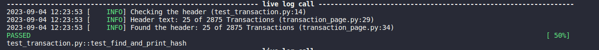
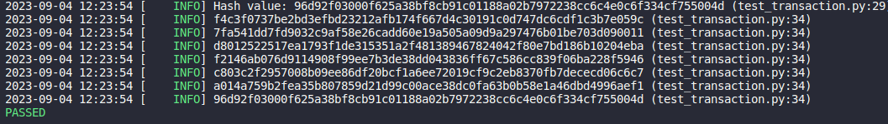

# UI Automation Framework with Python and Pytest

This readme explains the installation and usgae of the UI testing framework developed using Python and Pytest as a testing framework

## Contents

- [Introduction](#markdown-header-introduction)
- [Installation](#markdown-header-installation)
- [Usage](#markdown-header-usage)
- [Results](#markdown-header-results)

## Introduction

The framework is designed using Python and Pytest. The tests cases written covers two cases for Application Under Test(AUT).

## Installation 

Download the folder and unzip it. 
Cd to the project and run `poetry install` to install all necessary and releated dependencies.
Selenium 4 is used for the project.

** Activate virtual environment as a best practise to run the tests.

## Usage

Once your project is set up and all the dependencies are installed without failure. You can run your tests now. 
But before jumping directly on how to run the tests, let us understand about the structure of the project.

- Folder Structure 
```
blockchain_ui_tests/
├── pages/
│   ├── transaction_page.py : contains all the necessary functions used in tests
├── test/
│   ├── test_transactions.py : contains two tests, checking for header and printing transactions hash
├── .gitignore
├── conftest.py
├── poetry.lock
├── pyproject.toml
├── pytest.ini
└── README.md : readme for installations and usage
```

### Run using command line

If you want to run your tests using command line, please use the following command

```
    Open your terminal
    cd to the project folder
    Run : poetry run pytest
```
The above will collect all the tests and runs them. 

## Results

TC01 : Navigate to the URl and check that header should contain text: 25 of 2875 Transactions



TC02 : For all the 25 Transactions, print hash of all those having exactly 1 input and 2 output


